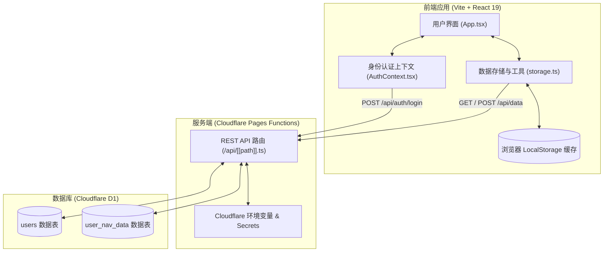
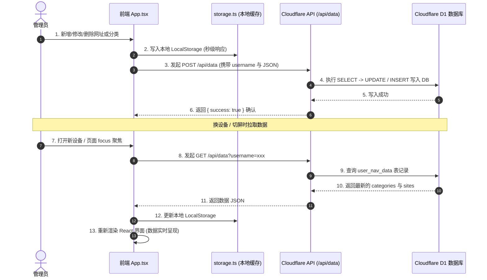

# ApexNav 系统架构与数据同步链路文档 (System Architecture)

本文档旨在详述 **ApexNav** 的整体软件架构设计、组件职责划分、数据持久化机制与跨设备数据同步链路。

---

## 🏗️ 系统架构图 (Architecture Diagram)



---

## 🔄 数据同步链路与生命周期 (Synchronization Data Flow)

ApexNav 支持高效、低延迟的**双向无感同步**与**多端平滑同步**：



---

## 💾 数据持久化与降级策略 (Persistence & Fallback Strategy)

ApexNav 设计了 3 层数据回退机制，确保在各种网络与配置环境下均能稳定运行：

```
┌────────────────────────────────────────────────────────┐
│  Tier 1: Cloudflare D1 边缘数据库 (服务端数据源)          │
└───────────────────────────┬────────────────────────────┘
                            │ (D1 未绑定 / 离线时降级)
                            ▼
┌────────────────────────────────────────────────────────┐
│  Tier 2: 浏览器 LocalStorage (账号隔离本地缓存)          │
└───────────────────────────┬────────────────────────────┘
                            │ (未登录访客模式降级)
                            ▼
┌────────────────────────────────────────────────────────┐
│  Tier 3: 默认通用演示数据 (DEFAULT_CATEGORIES / SITES)   │
└────────────────────────────────────────────────────────┘
```

1. **第一层 (D1 数据库)**：已登录账号且 Cloudflare D1 已绑定，数据全量托管于云端。
2. **第二层 (LocalStorage)**：离线网络或单机环境下，数据全量保留在本地浏览器。
3. **第三层 (默认预设数据)**：未登录访客访问时，呈现通用的演示导航网格，隔离管理员数据。

---

## 📁 目录结构与模块职责 (Directory Structure)

```text
ApexNav/
├── functions/               # Cloudflare Pages Functions 服务端后端代码
│   └── api/
│       └── [[path]].ts      # 认证、数据同步、分类与节点 REST API 统一路由
├── public/                  # 静态资源与预览截图
├── src/
│   ├── components/          # 视图组件
│   │   ├── BookmarkGrid.tsx    # 网址分类网格卡片与右键/内联操作
│   │   flex SearchHero.tsx       # 4 大搜索引擎、搜索建议与书签本地搜索
│   │   ├── SettingsModal.tsx    # macOS 风格双栏控制台 (网址/分类/数据/安全)
│   │   ├── PinModal.tsx         # 登录与密码弹窗
│   │   ├── StatusMonitorCard.tsx# 节点在线监控与延迟检测卡片
│   │   ├── Header.tsx           # 顶部导航栏 (时钟/切换壁纸/锁屏)
│   │   └── WidgetsGrid.tsx      # 日历、实时天气、每日一言挂件网格
│   ├── contexts/
│   │   └── AuthContext.tsx      # 管理员认证状态机与 Session 隔离
│   ├── utils/
│   │   └── storage.ts           # 存储工具库 (账号隔离、D1 API 交互)
│   ├── types.ts                 # TypeScript 数据模型与接口定义
│   ├── App.tsx                  # 应用入口与全局状态调度
│   └── main.tsx                 # React DOM 渲染入口
├── README.md                # 项目开源主页与快速上手指引
├── SECURITY.md              # 安全规范与零信任架构指南
├── ARCHITECTURE.md          # 本文档 (系统架构与数据流向)
└── schema.sql               # D1 数据库初始化表结构 SQL
```
