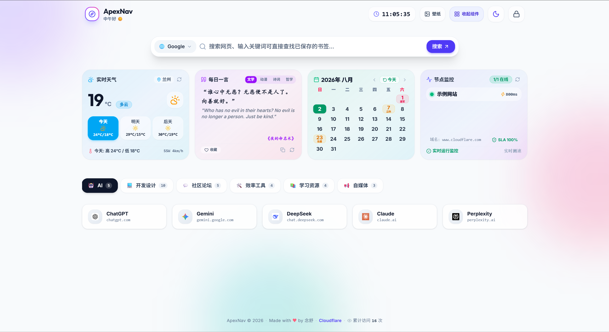
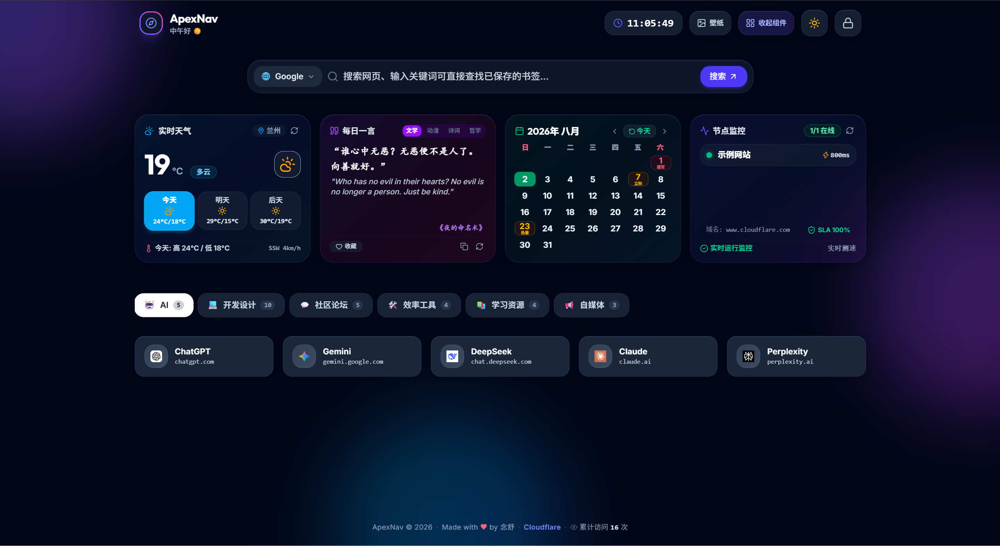

# 🍏 ApexNav (极简苹果风个人/公共导航主页)

ApexNav 是一款基于 **React 19 + TypeScript + Tailwind CSS v4 + Vite** 打造的苹果 Vision Pro 玻璃质感极简导航主页。自带多引擎搜索联想、Bento 小组件矩阵、多账号隔离与双模式权限控制、Cloudflare D1 跨设备云端实时同步与本地 JSON 备份恢复。

🌐 **官方线上演示站点**：[https://nav.nianshu2022.cn](https://nav.nianshu2022.cn)

---

## 📸 界面预览 (UI Screenshots)

### ☀️ 浅色主题 (Light Mode)


### 🌙 深色主题 (Dark Mode)


---

## ✨ 核心特性

- 🍎 **Vision Pro 苹果美学**：精致毛玻璃（Glassmorphism）、微交互动画、动态背景气泡与 Unsplash 5K/4K 随心高清壁纸。
- 🔍 **4 合 1 智能搜索**：内置 Google、Bing、Baidu、GitHub 引擎，支持键盘 `Tab` 快速切引擎、输入自动下拉联想词，支持回车跳转或直接检索本地书签。
- 👥 **多账号隔离 & 访客演示模式**：
  - **访客模式**：未登录时永远展示通用的演示网址与节点，只读防误触，任何修改不会污染公开视图。
  - **多账号独立存储**：支持多用户分别注册登录，登录 A 账号加载 A 的数据，登录 B 账号加载 B 的数据，数据完全隔离。
- 🌐 **Cloudflare D1 跨设备云同步**：支持手机、电脑、公司机器跨设备实时同步书签与节点，任何终端修改自动云端同步。
- 🍱 **Bento 小组件矩阵**：
  - 🌤️ **实时天气卡片**：自动定位 / 搜索切换城市、未来 3 天预报、24 小时气温趋势与空气指标。
  - 💬 **一言 Poetry 语录**：包含动漫、诗词、哲学分类，支持收藏与一键刷新。
  - 📅 **极简月历组件**：高清月视图与当前日期高亮。
  - ⚡ **节点运行监控**：支持节点 Ping 延迟测试与在线率统计。
- 🛡️ **优雅极简交互**：全站无原生 `alert`、`confirm`、`select` 割裂感，全自定义毛玻璃二次确认弹窗与快速分类 Emoji 选择器。
- 📦 **本地优先 & 一键备份**：优先存储于浏览器 `localStorage`，支持一键导出为 JSON 备份文件及随时导入还原。
- 🚀 **零成本部署**：天然适配 Cloudflare Pages，无需服务器费与云数据库费。

---

## 🛠️ 技术栈与目录结构

```text
ApexNav/
├── functions/api/[[path]].ts    # Cloudflare Pages Function (D1 跨设备同步 API)
├── public/                      # 静态资源与预览截图
│   └── docs/                    # 预览图片 (Light / Dark)
├── schema.sql                   # Cloudflare D1 数据库初始化表结构
├── src/
│   ├── components/              # 业务组件 (Header, SearchHero, Widgets, Modals...)
│   ├── contexts/                # 权限与多账号 AuthContext
│   ├── types.ts                 # TypeScript 接口类型定义
│   └── utils/storage.ts         # 本地持久化与 D1 云端同步逻辑
├── vite.config.ts               # Vite 配置文件
└── wrangler.toml                # Cloudflare Pages 配置文件
```

---

## 🚀 快速开始

### 1. 克隆项目与安装依赖

```bash
git clone https://github.com/nianshu2022/ApexNav.git
cd ApexNav
npm install
```

### 2. 本地开发启动

```bash
npm run dev
```
打开浏览器访问 `http://localhost:5173` 即可预览。

### 3. 构建生产包

```bash
npm run build
```
打包输出目录为 `dist/`。

---

## ☁️ 部署指南 (Cloudflare Pages)

1. 登录 [Cloudflare Dashboard](https://dash.cloudflare.com/)。
2. 导航至 **Workers & Pages** -> **Create application** -> **Pages** -> **Connect to Git**。
3. 选择你的 **ApexNav** 仓库。
4. 构建设置填入：
   - **Framework preset**: `Vite`
   - **Build command**: `npm run build`
   - **Build output directory**: `dist`
5. 点击 **Save and Deploy** 即可完成部署！

---

## 📲 开启跨设备云端同步 (Cloudflare D1 绑定)

若需开启手机、电脑等多设备数据实时同步：

1. 打开 Cloudflare 控制台 -> **Storage & Databases** -> **D1** -> 点击 **Create database**（数据库名称填 `apexnav-db`）。
2. 进入你的 Pages 项目 -> **Settings** -> **Functions** -> **D1 database bindings** -> 点击 **Add binding**：
   - **Variable name**: `DB`
   - **D1 database**: 选择刚才创建的 `apexnav-db`
---

## 🔒 终极安全认证：通过 Cloudflare 环境变量配置管理员账号密码

除了在前端或数据库中注册之外，**最高级别的安全推荐**是将管理员账号与密码直接托管在 **Cloudflare Pages 环境变量 / 加密秘钥 (Environment Variables & Secrets)** 中，由 Cloudflare 云端边缘节点进行服务端安全校验：

1. 登录 [Cloudflare Dashboard](https://dash.cloudflare.com/) -> **Workers & Pages** -> 点击你的 `apexnav` 项目。
2. 导航至 **Settings** -> **Environment variables** -> 点击 **Add variable**（环境选择 *Production* 及 *Preview*）：
   - 变量 1 名称：**`ADMIN_USERNAME`** ➡️ 值填你的管理员用户名（例如 `nianshu`）
   - 变量 2 名称：**`ADMIN_PASSWORD`** ➡️ 点击右侧 **Encrypt (加密秘钥/Secret)**，值填你的专属密码（例如 `YourStrongPassword123`）
3. 保存设置，并在 **Deployments** 中点击 **Retry deployment**（重新部署）即可生效！

> 🛡️ **终极安全保障**：管理员账号密码锁定在 Cloudflare 官方云端，前端无法篡改，公网也禁止随意注册，所有登录校验均在服务端边缘计算中加密完成！

---

## 🔑 首次登录与权限说明

- **访客**：打开页面默认呈现通用演示网址，无法在首页误触修改。
- **管理者**：
  1. 点击右上角 **🔒 锁头图标**。
  2. 首次使用时，弹窗会自动提示 **“设置管理账号”**，输入你自定义的用户名和密码即可。
  3. 登录成功后右上角呈现 **⚙️ 齿轮图标**，进入 **设置 -> 网址管理** 可安全进行增删改。
  4. 支持在 **设置 -> 账号安全** 中随时修改账号密码或退出登录。

---

## 📄 开源协议

本项目采用 [MIT License](LICENSE) 协议开源。欢迎 Star 与 Fork！
