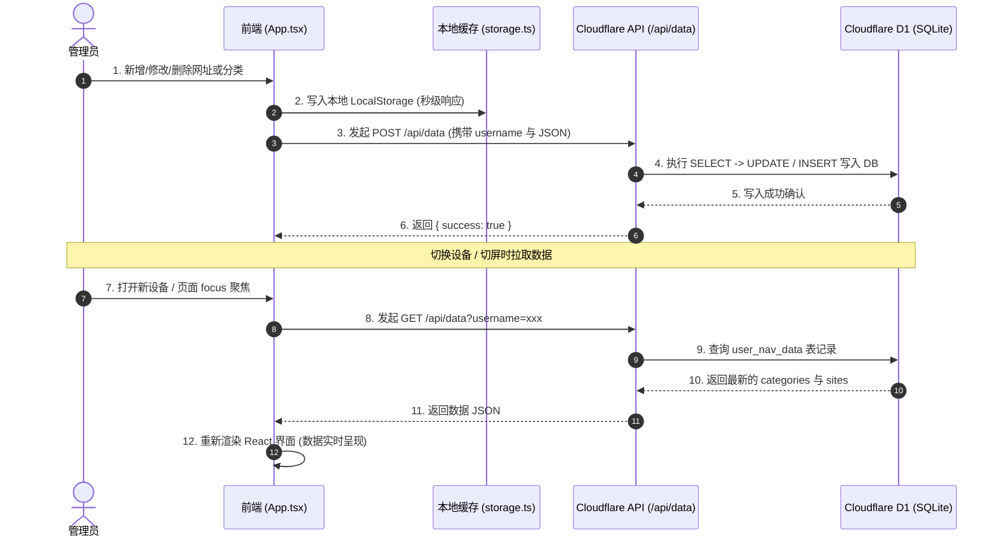

# 🍏 ApexNav (极简苹果风个人/公共导航主页)

[](LICENSE)
[](https://react.dev/)
[](https://www.typescriptlang.org/)
[](https://pages.cloudflare.com/)

ApexNav 是一款基于 **React 19 + TypeScript + Tailwind CSS v4 + Cloudflare Pages & D1** 打造的苹果 Vision Pro 毛玻璃质感极简个人/公共网址导航系统。

**本项目的核心设计原则**：不仅仅是一个 Vibe Coding 成果，更是**架构严密、安全规范、零成本运维、可长期维护的开源项目**。

🌐 **官方线上演示站点**：[https://nav.nianshu2022.cn](https://nav.nianshu2022.cn)

---

## 📚 详细文档导航 (Documentation Index)

- 🔒 [**SECURITY.md**](SECURITY.md)：零信任安全架构、Cloudflare Secrets 托管、访问控制矩阵与安全部署规范。
- 🏗️ [**ARCHITECTURE.md**](ARCHITECTURE.md)：系统架构视图、Cloudflare D1 数据双向同步链路、离线降级策略与模块职责划分。

---

## 📸 界面预览 (UI Screenshots)

### ☀️ 浅色主题 (Light Mode)


### 🌙 深色主题 (Dark Mode)


---

## 🏛️ 系统架构与数据同步链路

ApexNav 采用 **前级边缘节点 (Cloudflare Pages Function) + 后级 Serverless 数据库 (Cloudflare D1) + 客户端账号隔离缓存 (LocalStorage)** 的三层持久化架构：



详见 [ARCHITECTURE.md](ARCHITECTURE.md) 查看完整的序列图与持久化层级。

---

## ✨ 核心特性与技术亮点

- 🍎 **Vision Pro 苹果美学**：精致毛玻璃（Glassmorphism）、微交互动画、动态背景气泡与 Unsplash 5K/4K 随心高清壁纸。
- 🔍 **4 合 1 智能搜索**：内置 Google、Bing、Baidu、GitHub 引擎，支持键盘 `Tab` 快速切引擎、输入自动下拉联想词，支持回车跳转或直接检索本地书签。
- 👥 **多账号隔离 & 访客演示模式**：
  - **访客模式**：未登录时永远展示通用的演示网址与节点，只读防误触，任何修改不会污染公开视图。
  - **多账号独立存储**：数据严格按照 `username` 进行用户隔离与权限校验。
- 🌐 **Cloudflare D1 跨设备云同步**：支持手机、电脑、公司机器跨设备实时同步书签与节点，任何终端修改自动云端同步。
- 🛡️ **Cloudflare Secrets 边缘密钥托管**：管理员账号密码可直接部署在 Cloudflare 云端环境变量秘钥中，前端零密码露出的零信任架构（详见 [SECURITY.md](SECURITY.md)）。
- 🍱 **Bento 小组件矩阵**：
  - 🌤️ **实时天气卡片**：自动定位 / 搜索切换城市、未来 3 天预报、24 小时气温趋势与空气指标。
  - 💬 **一言 Poetry 语录**：包含动漫、诗词、哲学分类，支持收藏与一键刷新。
  - 📅 **极简月历组件**：高清月视图与当前日期高亮。
  - ⚡ **节点运行监控**：支持节点 Ping 延迟测试与在线率统计。
- 📦 **本地优先 & 一键备份**：优先存储于浏览器 `localStorage`，支持一键导出为 JSON 备份文件及随时导入还原。

---

## 🛠️ 目录结构与模块划分

```text
ApexNav/
├── functions/api/[[path]].ts    # Cloudflare Pages Function (D1 跨设备同步 REST API)
├── public/                      # 静态资源与预览截图
├── schema.sql                   # Cloudflare D1 数据库初始化 SQL
├── src/
│   ├── components/              # 业务组件 (Header, SearchHero, Widgets, Modals...)
│   │   └── SettingsModal.tsx    # macOS 双栏控制台 (网址/分类/数据/安全)
│   ├── contexts/                # 权限与多账号 AuthContext
│   ├── types.ts                 # TypeScript 接口类型定义
│   └── utils/storage.ts         # 本地持久化与 D1 云端同步逻辑
├── SECURITY.md                  # 零信任安全规范与访问控制矩阵
├── ARCHITECTURE.md              # 架构图、数据流向与持久化层级说明
├── vite.config.ts               # Vite 配置文件
└── README.md                    # 本文档
```

---

## 🚀 快速上手与本地开发

### 1. 克隆项目与安装依赖

```bash
git clone https://github.com/nianshu2022/ApexNav.git
cd ApexNav
npm install
```

### 2. 本地开发启动

```bash
npm run dev
```
打开浏览器访问 `http://localhost:5173` 即可预览。

### 3. 构建生产包

```bash
npm run build
```
打包输出目录为 `dist/`。

---

## ☁️ 部署指南 (Cloudflare Pages 零成本部署)

1. 登录 [Cloudflare Dashboard](https://dash.cloudflare.com/)。
2. 导航至 **Workers & Pages** -> **Create application** -> **Pages** -> **Connect to Git**。
3. 选择你的 **ApexNav** 仓库。
4. 构建设置填入：
   - **Framework preset**: `Vite`
   - **Build command**: `npm run build`
   - **Build output directory**: `dist`
5. 点击 **Save and Deploy** 即可完成部署！

---

## 📲 开启跨设备云端同步 (Cloudflare D1 绑定)

若需开启手机、电脑等多设备数据实时同步：

1. 打开 Cloudflare 控制台 -> **Storage & Databases** -> **D1** -> 点击 **Create database**（数据库名称填 `apexnav-db`）。
2. 进入你的 Pages 项目 -> **Settings** -> **Functions** -> **D1 database bindings** -> 点击 **Add binding**：
   - **Variable name**: `DB`
   - **D1 database**: 选择刚才创建的 `apexnav-db`
3. 保存并在 **Deployments** 中点击 **Retry deployment**（重新部署）即可！

---

## 🔒 终极安全配置 (Cloudflare Secrets 秘钥托管)

推荐将管理员账号与密码直接托管在 **Cloudflare Pages 环境变量 (Environment Variables & Secrets)** 中：

1. 打开 Cloudflare Dashboard -> **Workers & Pages** -> 点击 `apexnav` 项目。
2. 导航至 **Settings** -> **Environment variables** -> **Add variable**：
   - 变量 1：**`ADMIN_USERNAME`**（值填你的管理员用户名，如 `nianshu`）
   - 变量 2：**`ADMIN_PASSWORD`**（勾选 **Encrypt 加密密钥**，值填你的专属密码）
3. 保存并重新部署项目即可！详见 [SECURITY.md](SECURITY.md)。

---

## 📄 开源协议 (License)

本项目采用 [MIT License](LICENSE) 协议开源。欢迎 Star、Fork 与提交 PR！
