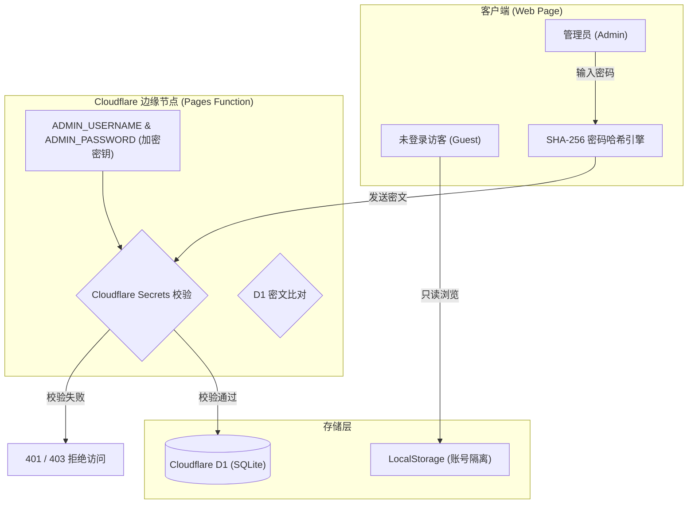

# ApexNav 安全规范与零信任架构指南 (Security Specifications)

本文档旨在阐明 **ApexNav** 项目的安全架构、身份认证模型、访问控制策略与安全最佳实践。ApexNav 专为开源部署与长期维护设计，遵循零信任（Zero-Trust）与服务端密钥托管原则。

---

## 🛡️ 安全架构概览 (Security Architecture)

ApexNav 采用 **Cloudflare Pages 边缘节点 + Cloudflare D1 (Serverless SQLite) + 客户端加密** 的轻量级高安全架构。



---

## 🔑 身份认证与权限控制矩阵 (Access Control Matrix)

ApexNav 划分了严格的两种运行权限模式：

| 功能维度 | 访客模式 (Guest Mode) | 管理员模式 (Admin Mode) |
| :--- | :--- | :--- |
| **身份认证** | 无需认证 | Cloudflare Secrets / D1 密文校验 |
| **网址与分类查看** | 只读 (默认预设网址) | 读取专属账号下的全量分类与网址 |
| **增删改分类/网址** | ❌ 彻底禁用 | ✅ 允许并自动同步至 D1 |
| **节点监控管理** | ❌ 只能查看在线率 | ✅ 可添加/编辑/删除监控节点 |
| **D1 数据库写权限** | ❌ 后端接口 401/403 拒绝 | ✅ 允许 `POST /api/data` 写入 |
| **公网账号注册** | ❌ 已启用 Secrets 时禁止注册 | ❌ 不开放自由注册 |

---

## 🔒 核心安全机制 (Core Security Features)

### 1. Cloudflare Secrets 服务端密钥托管 (推荐)
- 将管理员账号与密码直接托管在 Cloudflare 控制台的 **Environment Variables & Secrets** 中 (`ADMIN_USERNAME` 与 `ADMIN_PASSWORD`)。
- **安全优势**：
  - 前端 JavaScript 代码中**不包含任何明文密码或管理员用户名**。
  - 公网随意注册功能被服务端自动关闭 (`403 Forbidden`)。
  - 密码校验 100% 在 Cloudflare 云端边缘节点进行，防篡改、防拖库。

### 2. 客户端零信任 SHA-256 密文传输
- 用户在登录弹窗中输入密码后，客户端通过 Web Crypto API (`crypto.subtle.digest('SHA-256', ...)` ) 将密码转换为不可逆的 256 位哈希值。
- 网络传输中绝不发送明文密码，防中间人窃听（MITM）。

### 3. SQL 注入防护 (Prepared Statements)
- 后端 Cloudflare Function (`functions/api/[[path]].ts`) 所有的 D1 数据库操作**严格使用参数化绑定 (Prepared Statements)**：
  ```typescript
  await env.DB.prepare('SELECT * FROM user_nav_data WHERE username = ?')
    .bind(cleanUn)
    .first();
  ```
- 彻底杜绝 SQL 注入漏洞。

### 4. 账号级隔离与数据安全
- D1 数据库以 `username` 作为主键/用户标识，多用户数据相互隔离。
- 本地 `localStorage` 采用 `apexnav_categories_{username}` 账号命名空间隔离，防止本地多账号数据混淆。

---

## 🛠️ 安全部署指南 (Security Deployment Checklist)

在将 ApexNav 部署到生产环境时，建议完成以下安全配置：

- [ ] **开启 Cloudflare Pages 环境变量密钥**：
  在 Cloudflare Pages 项目设置中添加 `ADMIN_USERNAME` 与 `ADMIN_PASSWORD`（设置为 Secret 加密变量）。
- [ ] **启用 HTTPS 强制重定向**：
  在 Cloudflare 域名设置中开启 *Always Use HTTPS* 与 *HSTS*。
- [ ] **定期备份数据**：
  在设置面板中定期使用 **“导出 JSON 备份文件”** 保存本地份。

---

## 📩 漏洞报告与响应 (Reporting a Vulnerability)

如果您在 ApexNav 中发现了安全漏洞，请勿直接公开提 Issue。请通过以下方式提交私密报告：

- **Email**: `2478951652@qq.com`
- 我们将在 48 小时内确认报告并进行安全修复与更新。
